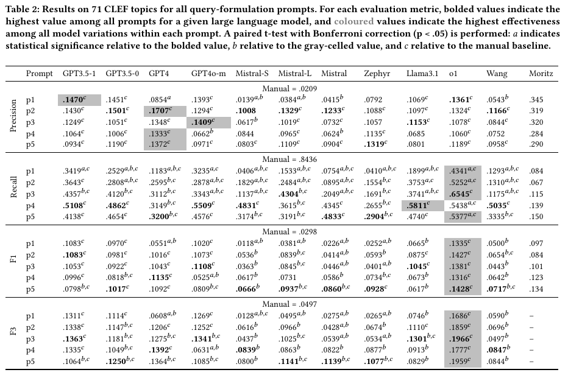
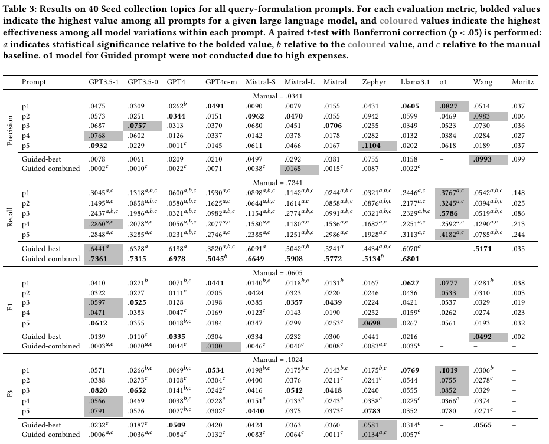
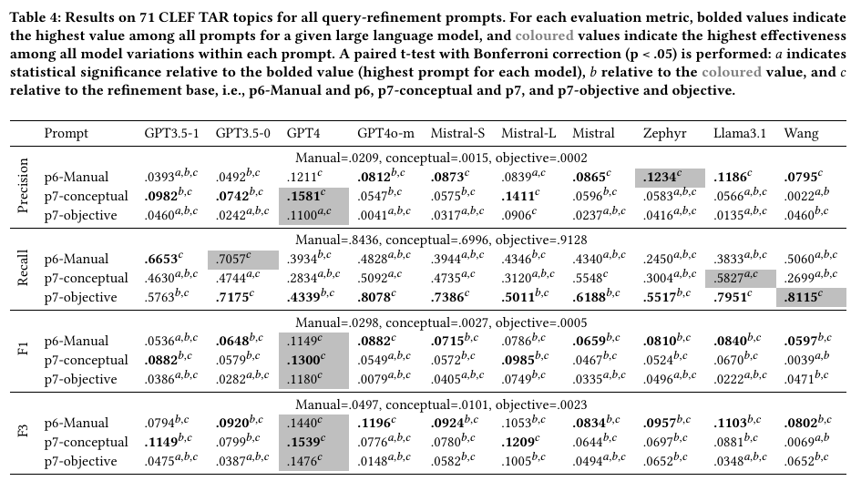

# Boolean_Generation_Reproduce
Boolean Query Generation Reproduce
---

## 1. Prerequisites

1. **Python 3.10**  
   Code are run and tested on Python 3.10

2. **Required Python Libraries**  
    The following Python libraries are required to run the code:
    - `torch`
    - `transformers`
    - `openai`
    - `mistralai`
    - `biopython`

## 2. Formulation or Refinement of Boolean Queries (q1-q7)

📌 Note: In the paper, we used P1 to Pn to represent different prompts. In this script, we use q1 to qn, which directly correspond to P1–Pn.

Below is the script that runs the reproduction of the Boolean Query Formulation/Refinement Prompts
    
```bash
python3 process_reproduce.py
  --input_queries data/topics/CLEF-2018.jsonl # input queries, could be either CLEF-2018.jsonl or seed_collection.jsonl
  --method api_based # either api_based or l
  --llm_prompt_file ${prompt} # prompt file, should store in generation_prompts folder
  --model ${model} # model name, such as gpt-3.5-turbo-0125 for api_based and mistralai/Mistral-7B-Instruct-v0.2 for llm_based
  --date_file data/topics/combined_pubdates # date file, needed for CLEF, not Seed Collection
  --output_folder CLEF-2018_reproduce/${model}/${prompt}_v${time} # output folder
  --no_retrieval False # if True, formulated Boolean query will not be retrieved
  --json_output False # if True, output will be enforced to json
```


## 3. Evaluation of Boolean Queries

Below is the script that runs the reproduction of the Boolean Query Evaluation

```bash
python3 eval_all.py \
  --input_trec_folder CLEF-2018_reproduce/${model}/${prompt}_v${time}/final_trec_result \ # trec result folder
  --input_qrels data/topics/qrels_2018.txt # qrels file
```


---

## Patch of Incompleted Results from Submitted Paper

Sorry that in the submitted paper, we have some incompleted results (even though in description, we missed in the original tables). Here are the patch for the incompleted results.

### Table 2

</img>

### Table 3
</img>

### Table 4
</img>


---
# Result Comparison to Moritz et al.

## CLEF

Table for Precision

| Prompt       | Wang et al. | GPT-3.5-1106 | GPT-3.5-0125 | GPT-4  | Mistral-tiny | Mistral-small | Mistral-local | Zephyr |
|--------------|-------------|--------------|--------------|--------|--------------|---------------|---------------|--------|
| Manual       | 0.021       |              |              |        |              |               |               |        |
| p1-Ours      | 0.054       | 0.147        | 0.145        | 0.085  | 0.014        | 0.038         | 0.042         | 0.079  |
| p1-Moritz    | 0.054       | 0.319        | 0.072        | 0.362  | 0.233        | 0.249         | 0.281         | 0.122  |
| p2-Ours      | 0.117       | 0.143        | 0.150        | 0.171  | 0.101        | 0.133         | 0.123         | 0.108  |
| p2-Moritz    | 0.117       | 0.320        | 0.070        | 0.350† | 0.233        | 0.144         | 0.258         | 0.148  |
| p3-HQE-Ours  | 0.084       | 0.125        | 0.105        | 0.135  | 0.062        | 0.102         | 0.073         | 0.106  |
| p3-HQE-Moritz | 0.084       | 0.284†       | 0.044        | 0.378† | 0.249        | 0.114         | 0.160         | 0.099  |
| p4-HQE-Ours  | 0.075       | 0.106        | 0.101        | 0.133  | 0.084        | 0.097         | 0.062         | 0.114  |
| p4-HQE-Moritz | 0.075       | 0.284†       | 0.044        | 0.330† | 0.114        | 0.030         | 0.099         | 0.055  |
| p5-HQE-Ours  | 0.096       | 0.093        | 0.119        | 0.137  | 0.080        | 0.111         | 0.090         | 0.132  |
| p5-HQE-Moritz | 0.096       | 0.290†       | 0.050        | 0.355† | 0.104        | 0.160         | 0.181         | 0.129  |

Table for Recall

| Prompt | Wang et al. [54] | GPT-3.5-1106 | GPT-3.5-0125 | GPT-4 | Mistral-tiny | Mistral-small | Mistral-local | Zephyr |
|--------|-----------------|--------------|--------------|-------|--------------|---------------|---------------|--------|
| Baseline | 0.832 |              |              |       |              |               |               |        |
| q1-Ours | 0.129 | 0.342        | 0.253        | 0.118 | 0.041        | 0.153         | 0.075         | 0.041  |
| q1-Moritz | 0.129 | 0.084        | 0.019        | 0.072 | 0.046        | 0.062         | 0.037         | 0.015  |
| q2-Ours | 0.131 | 0.364        | 0.281        | 0.260 | 0.183        | 0.248         | 0.090         | 0.155  |
| q2-Moritz | 0.131 | 0.067        | 0.019        | 0.093 | 0.026        | 0.021         | 0.025         | 0.017  |
| q3-Ours | 0.118 | 0.436        | 0.412        | 0.311 | 0.114        | 0.430         | 0.205         | 0.169  |
| q3-Moritz | 0.118 | 0.115        | 0.026        | 0.086 | 0.041        | 0.063         | 0.038         | 0.007  |
| q4-HQE-Ours | 0.504 | 0.511        | 0.486        | 0.315 | 0.483        | 0.362         | 0.435         | 0.266  |
| q4-HQE-Moritz | 0.504 | 0.139        | 0.033        | 0.086 | 0.063        | 0.067         | 0.020         | 0.062  |
| q5-HQE-Ours | 0.334 | 0.414        | 0.465        | 0.320 | 0.317        | 0.319         | 0.483         | 0.290  |
| q5-HQE-Moritz | 0.334 | 0.150        | 0.027        | 0.091 | 0.043        | 0.060         | 0.053         | 0.005  |


## Seed Collection


Coming soon


